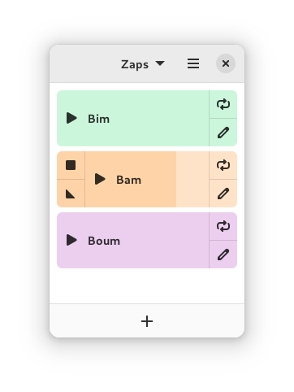

<!--
SPDX-FileCopyrightText: 2022 Romain Vigier <contact AT romainvigier.fr>

SPDX-License-Identifier: CC-BY-SA-4.0
-->

# Zap

Play all your favorite sound effects! This handy soundboard makes your livestreams and videocasts more entertaining.

Import audio files, arrange them in collections and customize their appearance.

This project is a fork of the original [Zap](https://gitlab.com/rmnvgr/zap) by Romain Vigier.

## New Features & Improvements

- **Persistent Grouping System**: Create, rename, and delete groups to organize your Zaps. Groups are saved permanently and support drag-and-drop organization.
- **Preferences & Safety Mode**: New settings window with a "Safety Mode" to prevent accidental overlapping and a "Hide Stop Button" option for a cleaner, fade-only experience.
- **Improved Import/Export**: Back up everything (collections, groups, sounds, and settings) into a `.zap` archive. Includes duplicate detection and full settings synchronization.
- **Expanded Color Palette**: 18 beautiful colors optimized for Dark Mode and accessibility.
- **Linux Installation Scripts**: Included `install-linux.sh` and `uninstall-linux.sh` for easy setup on Linux systems without Flatpak.
- **Enhanced Stability**: Optimized UI refresh logic, fixed memory corruption issues, and improved performance.



## Installing

Zap is available as a Flatpak on Flathub:

<a href="https://flathub.org/apps/details/fr.romainvigier.zap"></a>

## Building from source

### Dependencies

- GJS >= 1.73.2
- GTK >= 4.8.0
- Libadwaita >= 1.2.0
- GStreamer >= 1.20.0
- Tracker >= 3.4.0

### Using Meson

```
meson builddir
meson install -C builddir
```

See [`meson_options.txt`](./meson_options.txt) for available options.

### Using Flatpak

```
flatpak-builder --install builddir build-aux/fr.romainvigier.zap.yml
```

The GNOME platform and SDK runtimes must be installed.


## Contributing

See [`CONTRIBUTING.md`](./CONTRIBUTING.md).

The application is part of [GNOME Circle](https://circle.gnome.org/), so the [GNOME Code of Conduct](https://wiki.gnome.org/Foundation/CodeOfConduct) applies to this project.
